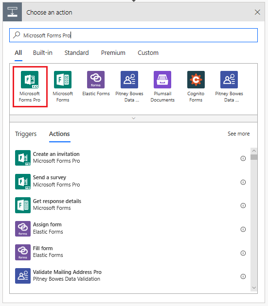
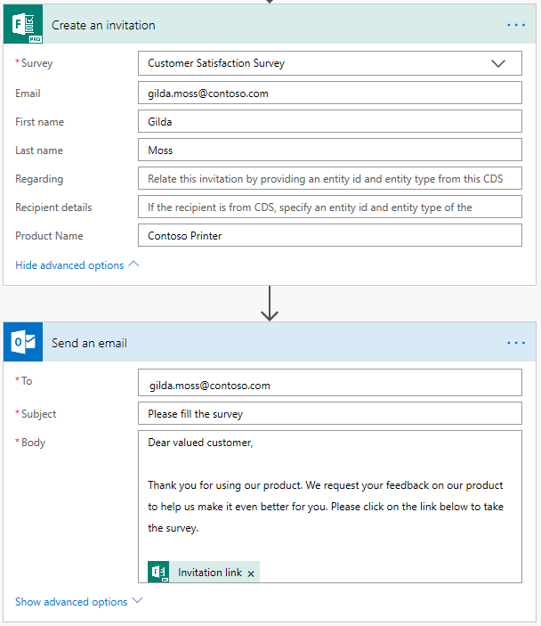

# Create a survey invitation

[!include[cc-beta-prerelease-disclaimer](includes/cc-beta-prerelease-disclaimer.md)]

If you want to send a survey using a platform other than Microsoft Forms Pro, such as Outlook, Gmail, or SMS, you can create a survey invitation using Microsoft Flow. The survey invitation creates a personalized link that can be distributed by using a platform of your choice.

1. Sign in to [flow.microsoft.com](https://flow.microsoft.com).

2. Start to create a flow from scratch. For information on creating a flow from scratch, see [Create a flow in Microsoft Flow](https://docs.microsoft.com/en-us/flow/get-started-logic-flow).

3. In the flow editor, add a trigger to start your flow.

4. After adding the trigger, add a new step and search for the **Microsoft Forms Pro** connector.

5. In search results, select **Microsoft Forms Pro**.

    > [!div class=mx-imgBorder]
    >   

6. Select the **Create an invitation (preview)** action.

    > [!div class=mx-imgBorder]
    >  action")  

7. In the **Create an invitation** action, enter or select the following information:

    - **Survey**: Select the survey to be sent.
    - **Email**: Enter the recipient's email address.
    - **Regarding**: Specify a record to associate survey invitation and response. This value is stored in the survey invitation's **Regarding** field.
    - **Recipient details**: Specify a contact to associate your survey invitation and response records. This value is stored in the survey invitation's **To** field. Only Contact record is supported.

    > [!NOTE]
    > - If you want to associate your survey invitation and response with Common Data Service, you must enter values in **Regarding** and **Recipient details** fields accordingly. For more information on **Regarding** and **Recipient details** fields and how they are stored in the survey invitation, see [Send a survey action](send-survey-microsoft-flow.md#send-a-survey-action).
    > - If you've used personalized data placeholders in your survey, those fields will be visible in this action and you can specify the values accordingly. More information: [Specify values in a flow](personalize-survey.md#specify-values-in-a-flow)

8. Add a new step and select the action to send the email. You can use providers such as Outlook, Gmail, or SMS; we have used Outlook to send the survey in this procedure.

9. In the **Send an email** action, enter the following information: 

    - **To**: Recipient's email address.
    - **Subject**: Subject of the email.
    - **Body**: Enter the required text and add **Invitation link** dynamic content.

    After entering the required details, the flow looks as shown in the following image:

    > [!div class=mx-imgBorder]
    > 

    The flow runs as per the configured trigger and the sends the survey.

## See also

[Define who can respond to a survey](invite-settings.md) 
[Send a survey by using email](send-survey-email.md) 
[Send a survey by using Microsoft Flow](send-survey-microsoft-flow.md) 
[Embed survey in a webpage](embed-web-page.md) 
[Send a survey link to others](send-survey-link.md) 
[Send a survey QR code](send-survey-qrcode.md)

