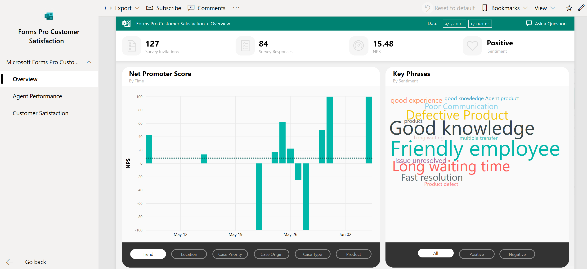
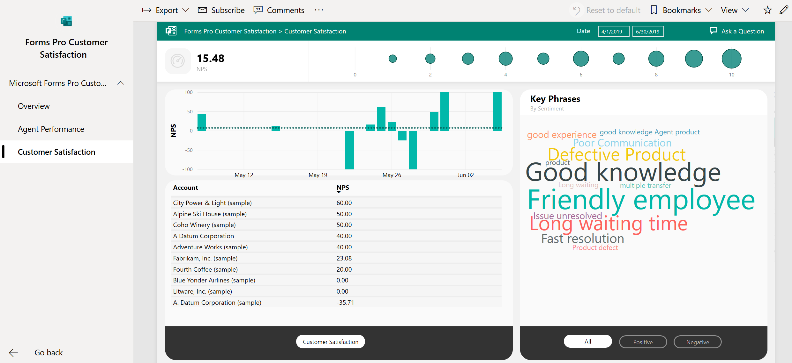

# Monitor customer satisfaction

Use the Microsoft Forms Pro Customer Satisfaction app to get an insights report that links customer feedback with the cases when you use Forms Pro to send a survey after case resolution in Dynamics 365 Customer Service. You can view average Net Promoter Score (NPS) in addition to your agents' and customers' individual NPS. You can use this app to filter the report by case parameters such as priority, location, product, and more. Survey metrics&mdash;such as number of survey invitations sent, number of survey responses received, NPS, sentiment, and key phrases&mdash;are also displayed in the report. You can edit the reports and customize them for your needs.

## Install the Forms Pro Customer Satisfaction app

The Forms Pro Customer Satisfaction app is a template app built using Power BI. This app helps you to discover your customers' satisfaction and your agents' performance. You can connect your Dynamics 365 Customer Service instance to view insights based on your business data. The app includes sample data for you to navigate as you explore the app. It also gives you the capability to edit and customize the workspace to meet your needs.

For more information about template apps, see [What are Power BI template apps?](https://docs.microsoft.com/power-bi/service-template-apps-overview).

For steps to install a template app and get started, see [Install and distribute template apps](https://docs.microsoft.com/power-bi/service-template-apps-install-distribute).

### Connect to Dynamics 365 Customer Service data

If you choose to connect to Dynamics 365 Customer Service data, enter the URL associated with your Dynamics 365 Customer Service instance (for example, `http://contoso.crm.dynamics.com/`), and then select **Next**. If prompted, select **oAuth2** as the authentication method, select **Sign in**, and then enter your credentials.

> [!NOTE]
> We recommend that you have the latest version of Dynamics 365 Customer Service.

## Report

The Forms Pro Customer Satisfaction app displays insights in a report with the following pages:

- [Overview](#overview)
- [Agent Performance](#agent-performance)
- [Customer Satisfaction](#customer-satisfaction)

You can filter the data using the **Date** filter at the top of the report. The data is filtered based on the survey invitations sent during the selected time period. Let's say you've sent 100 survey invitations during the selected time period. You received 60 responses within the time period and 20 responses after the time period. The 20 responses will also be included in the report.

If you'd like to select a different survey for displaying insights, you can do it from the **Filters** pane on the right side of the report. Open the pane, and then select a survey from the **Survey Name** filter under **Filters on all pages**. For more information about working with filters in Power BI reports, see [The new filter experience in Power BI reports](https://docs.microsoft.com/power-bi/power-bi-report-filter).

For more information about working with reports, see [Reports in Power BI](https://docs.microsoft.com/power-bi/consumer/end-user-reports).

### Overview

The **Overview** page provides an overview of customer satisfaction data. The following survey metrics are displayed across the top of the report:

- **Survey invitations**: Total number of survey invitations sent.
- **Survey responses**: Number of non-anonymous survey responses received.
- **NPS**: Average NPS of the survey.
- **Sentiment**: Sentiment of respondents, based on the survey responses.

The following information is displayed below the survey metrics:

- **Net Promoter Score**: The trend of average NPS over a period of time. The x-axis displays the time period, and the y-axis displays the average NPS. You can filter the NPS chart by using the following filters to view NPS variations and make effective decisions accordingly:

  - **Trend**: Displays the average NPS trend over a period of time by default.
  - **Location**: Displays the NPS trend by location. This helps you identify the locations from where positive or negative responses are coming and make decisions accordingly. For example, you received NPS from three locations: Loc1, Loc2, and Loc3. Insights showed that Loc3 has a better NPS than the other two locations. You might make the decision to focus on Loc1 and Loc2 and find out ways to improve NPS there.
  - **Case priority**: Displays the NPS trend by case priorities, such as high, low, or medium.
  - **Case origin**: Displays the NPS trend by the origin of the case, such as Facebook, phone, or Twitter.
  - **Case type**: Displays the NPS trend by the type of case, such as problem, request, or question.
  - **Product**: Displays the NPS trend by products associated with the cases.

- **Key Phrases**: Displays a word cloud of the key phrases used in sentiment analysis. You can filter to see only the positive or negative&mdash;or all&mdash;key phrases.

  > [!div class=mx-imgBorder]
  > 

### Agent Performance

The **Agent Performance** page provides an agent-centric view of satisfaction data. Customer service managers can use this page to analyze an agent's performance based on survey responses. The following information is displayed:

- **NPS**: Average NPS of the survey.
- A bubble chart at the top of the report displaying NPS distribution according to the number of agents.
- A bar chart displaying the trend of average NPS over a period of time.
- A grid containing agents' names and their corresponding NPS, sorted by the NPS value in descending order. You can select an agent's name to see the agent-specific data in all other charts.
- **Key Phrases**: Displays a word cloud of the key phrases used in sentiment analysis. You can filter to see only the positive or negative&mdash;or all&mdash;key phrases.

  > [!div class=mx-imgBorder]
  > 

### Customer Satisfaction

The **Customer Satisfaction** page provides the customer-centric view of the satisfaction data. Customer service managers can use this page to analyze a customer's satisfaction based on survey responses. The following information is displayed:

- **NPS**: Average NPS of the survey.
- A bubble chart at the top of the report displaying NPS distribution according to the number of customers.
- A bar chart displaying the trend of average NPS over a period of time.
- A grid containing satisfied customers and their corresponding NPS, sorted by the NPS value in descending order. You can select a customer's name to see the customer-specific data in all other charts.
- **Key Phrases**: Displays a word cloud of the key phrases used in sentiment analysis. You can filter to see only the positive or negative&mdash;or all&mdash;key phrases.

  > [!div class=mx-imgBorder]
  > 
