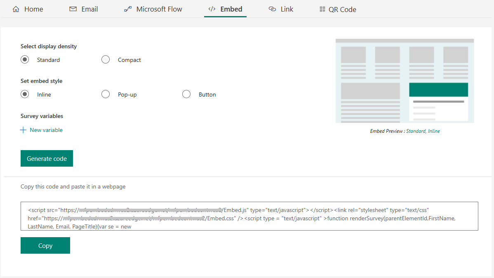

# Embed in a web page

You can embed your survey in a web page by pasting the embed code for that survey into your web page’s source code. You can embed your survey in the following ways:

- **Inline**: Displays the survey statically on the web page.

- **Pop-up**: Displays the survey in a pop-up window based on respondent’s action.

- **Button**: Displays the survey when a button is selected. By default, the button name is **Provide feedback**.

You can also select or define custom context parameters. Context parameters allow you to capture your respondent’s information and the context in which the response was provided and store it in the survey response. By default, first name, last name, email, and URL are available as context parameters. Additionally, you can define 10 custom context parameters.

If a response contains embed parameters, they are displayed on the **Embed parameters** tab.

1.  Open the survey you want to embed and go to **Send Survey** &gt;**Embed**.

2.  Under **Select the embed type for your survey**, select one of the following options:

    -   Inline

    -   Pop-up

    -   Button

3.  Optionally, under **Select parameters to add in embed code**, select one or all out-of-the-box parameters or select **Add custom parameter** to create a new parameter, as per your requirement.

4.  Select **Generate code**. The embed code is generated as per the selected options.

5.  Select **Copy** and then paste this embed code into a web page to embed your survey. You must then update the web page’s source code to render the survey on the web page. For information on how to update the source code, see [Update web page’s source code](#update-web-pages-source-code).  

      

## Update web page’s source code

After generating the embed code, you must add it into your web page’s source code and create a method that calls the renderSurvey` function to render the survey on the web page. You must ensure that values in the `renderSurvey` function are passed in the same order as parameters defined in the `renderSurvey` function in embed code.

For an inline survey, a parent div container must be defined for the survey to be displayed.

### Scenario to embed an inline survey

Let’s say you want to embed an inline survey into your web page, and you select three out-of-the-box context parameters (First Name, Last Name, and Email) and create one custom context parameter (PageTitle). The embed code is generated as follows:

```
<script src="https://www.contoso.com/Embed.js" type="text/javascript"></script><link rel="stylesheet" type="text/css" href="https://www.contoso.com/Embed.css" /><script type = "text/javascript" >function renderSurvey(parentElementId, FirstName, LastName, Email, PageTitle){var se = new SurveyEmbed("JtSG9ha000000000020pTSB1AovM_5u8bQH1UQjlNQjZRWV0000000000","https://www.contoso.com/");var context = {"FirstName": FirstName,"LastName": LastName,"Email": Email,"PageTitle": PageTitle,};se.renderInline(parentElementId, context);}</script>
```

In the above embed code, the `renderSurvey` function contains the `parentElementId` parameter in addition to the selected parameters. The `parentElementId` parameter receives the div container id when it is called.

You created a div container with the id as `surveyDiv` on the web page where you want to display the survey. This div container will display the survey statically in a designated area on the web page. You want to load the survey when the page loads, so you create a method as follows:

```
<script>
	 window.addEventListener('load', function () {
            renderSurvey("surveyDiv", "Bert", "Hair", "bert.hair@contoso.com", "Product Overview");
        }, false);
</script>

```

The above method calls the renderSurvey function and passes the required values accordingly. In the above method, static user details are passed, but you can provide a function that retrieves the logged-in user details.

