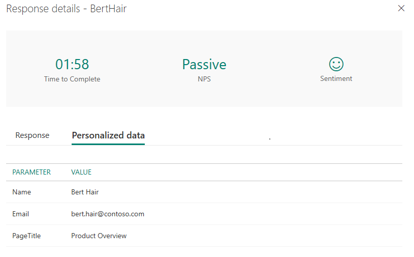

# Embed a survey in Power Apps

> [!NOTE]
> Microsoft Forms Pro has evolved into Dynamics 365 Customer Voice, providing you with additional survey capabilities and business benefits. The change is being introduced in phases and will be available in all geographical regions in the next few weeks, except for US Government Community Cloud customers. Dynamics 365 Customer Voice will be available on US Government Community Cloud by October 2020. For more information, see the [Dynamics 365 Customer Voice](https://go.microsoft.com/fwlink/p/?linkid=2128357) documentation.

[!include[cc-beta-prerelease-disclaimer](includes/cc-beta-prerelease-disclaimer.md)]

You can embed your surveys in the canvas apps created by using Power Apps. This allows users to respond to the surveys directly from the apps.

> [!NOTE]
> You must have Power Apps Plan 1 to embed your surveys in a canvas app. For more information about purchasing Power Apps, see [Purchase Power Apps for your organization](https://docs.microsoft.com/power-platform/admin/signup-for-powerapps-admin).

1.	Sign in to [Power Apps](https://web.powerapps.com/).

2.	Create a blank canvas app or use one of the available templates. For more information about creating a canvas app, see [Create a canvas app from scratch using Common Data Service](https://docs.microsoft.com/powerapps/maker/canvas-apps/data-platform-create-app-scratch).

3.	On the **Insert** tab, open the **Controls** menu, and then add the **Forms Pro survey (Preview)** control.

    > [!div class=mx-imgBorder]
    >  control")  

4.	In the options pane, select **No data**.

    > [!div class=mx-imgBorder]
    >   

5.	In the **Data** pane, select the survey you want to embed from the **Select survey** list.

    > [!div class=mx-imgBorder]
    > 

    The selected survey is rendered in the control.

    > [!div class=mx-imgBorder]
    > 

6.	To define context parameters, go to the **Advanced** tab in the options pane.

7.	In the **ContextParameters** field, enter context parameters as comma-separated key/value pairs. For example, `{Name:TextInput1.Text,Email:TextInput2.Text, PageTitle:Label1.Text}`.
    You use context parameters to capture your respondent's information and the context in which the response was provided, and store that data in the survey response.

    > [!div class=mx-imgBorder]
    > 

    If a response contains context parameters, they're displayed on the **Personalized data** tab.

    > [!div class=mx-imgBorder]
    > 

### See also

[Work with survey settings](invite-settings.md) 
[Send a survey by using email](send-survey-email.md) 
[Send a survey by using Power Automate](send-survey-flow.md) 
[Embed a survey in a webpage](embed-web-page.md) 
[Send a survey link to others](send-survey-link.md) 
[Send a survey QR code](send-survey-qrcode.md) 
[Create a survey invitation](create-survey-invite.md)
