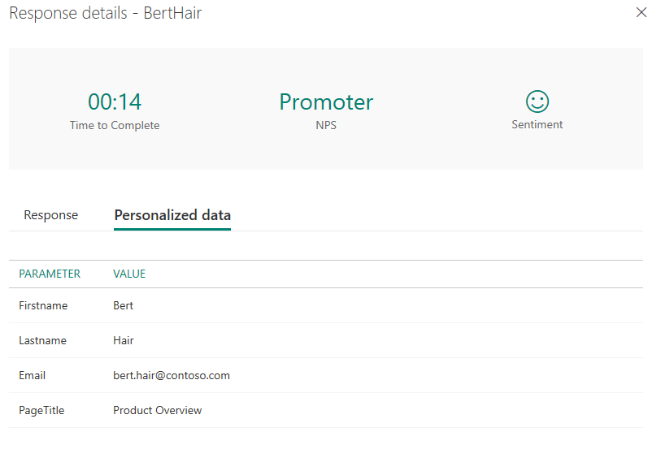

# Embed survey in a webpage

You can embed your survey in a webpage by pasting the survey's embed code into your webpage's source code. You can choose one of the following embed styles for your survey:

- **Inline**: Displays the survey statically on the webpage.

- **Pop-up**: Displays the survey in a pop-up window based on the respondent’s action.

- **Button**: Displays the survey when a button is selected. By default, the button name is **Provide feedback**.

You can also select a display density for your survey. The display density controls the amount of white spaces and the size of the elements on the screen. Following options are available for the display density:

- **Standard**: Displays the survey with the standard amount of white spaces and the size of the elements on the screen.

- **Compact**: Displays the survey with the reduced amount of white spaces and the size of the elements on the screen. By default, **Compact** is selected. This display density is useful for displaying the survey on smaller screen devices such as mobile or tablet.

If you have created survey variables, they will be used to capture your respondent's information and the context in which the response was provided and store that data in the survey response. You can also create new survey variables, if required. If the appropriate values are not passed to survey variables in the embed code, the default values will be used.

The values of survey variables in a response are displayed on the **Personalized data** tab.

> [!div class=mx-imgBorder]
> 

To embed your survey:

1.  Open the survey you want to embed, and select **Send** from the toolbar at the top of the page. 

2. Select **Embed**.

3.  Under **Select the embed type for your survey**, select one of the following options:

    -   Inline

    -   Pop-up

    -   Button

4. Under **Select display density**, select one of the following options:

    - Standard

    - Compact

5.  Optionally, under **Survey variables**, select **New variable** to create a new variable.

6.  Select **Generate code**. The embed code is generated as per the selected options.

7.  Select **Copy**, and then paste the embed code into a webpage to embed your survey. You must then update the webpage’s source code to render the survey on the webpage. For information on how to update the source code, see [Update a webpage's source code](#update-a-webpages-source-code).  

    > [!div class=mx-imgBorder]
    >   

## Update a webpage's source code

After generating the embed code, you must add it into your webpage’s source code. Then create a method that calls the **renderSurvey** function to render the survey on the webpage. You must ensure that the values in the **renderSurvey** function are passed in the same order as the survey variables that are defined in the **renderSurvey** function in the embed code.

For an inline survey, a parent **div** container must be defined for the survey to be displayed.

### Scenario to embed an inline survey

Let's say you want to embed an inline survey into your webpage, and you have created two survey variables (**Email** and **PageTitle**). The embed code is generated as follows:

```JavaScript
<script src="https://www.contoso.com/Embed.js" type="text/javascript"></script><link rel="stylesheet" type="text/css" href="https://www.contoso.com/Embed.css" /><script type = "text/javascript" >function renderSurvey(parentElementId, FirstName, LastName, Email, PageTitle){var se = new SurveyEmbed("JtSG9ha000000000020pTSB1AovM_5u8bQH1UQjlNQjZRWV0000000000","https://www.contoso.com/");var context = {"FirstName": FirstName,"LastName": LastName,"Email": Email,"PageTitle": PageTitle,};se.renderInline(parentElementId, context);}</script>
```

In the preceding embed code, the `renderSurvey` function contains the `parentElementId` parameter in addition to the survey variables. The `parentElementId` parameter receives the `div` container ID when it is called.

You created a `div` container with the ID `surveyDiv` on the webpage where you want to display the survey. This `div` container displays the survey statically in a designated area on the webpage. Because you'll want to load the survey when the page loads, create a method as follows:

```JavaScript
<script>
	 window.addEventListener('load', function () {
            renderSurvey("surveyDiv", "Bert", "Hair", "bert.hair@contoso.com", "Product Overview");
        }, false);
</script>

```

The preceding method calls the `renderSurvey` function and passes the required values accordingly. In this method, static user details are passed, but you can provide a function that retrieves the logged-in user details.

## See also

[Work with survey settings](invite-settings.md)<br>
[Send a survey by using email](send-survey-email.md)<br>
[Send a survey by using Microsoft Flow](send-survey-microsoft-flow.md)<br>
[Send a survey link to others](send-survey-link.md)<br>
[Send a survey QR code](send-survey-qrcode.md)<br>
[Embed a survey in PowerApps](embed-survey-powerapps.md)
