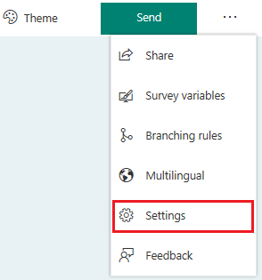
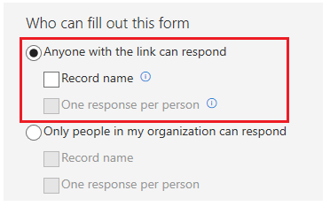
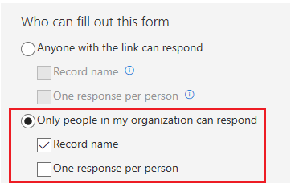
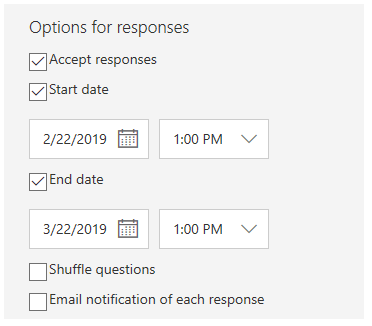

# Define who can respond to a survey 

You can create two types of surveys:

-   External surveys to get responses from customers on things like case resolutions or order closures.

-   Internal surveys to get responses from internal audiences like an event feedback.

In this topic, you'll learn about selecting survey settings and various response options.

## Select survey settings

After you have created a survey, you can select settings to control the responses to your survey. You can select whether anyone can respond to the survey or only the people in your organization can respond. The former option does not require a respondent to sign in, whereas the latter option requires a respondent to sign in.

Consider a scenario where you have created a survey to collect customer's feedback when a support case is resolved. In this scenario, you will require feedback from the people outside of your organization. To accomplish this, you will select the option **Anyone with the link can respond** in the survey settings. More information: [Anyone with the link can respond](#anyone-with-the-link-can-respond).

Let's consider another scenario where you have created a survey to collect feedback about an internal organization event and you want only the people in your organization to respond to the survey. To accomplish this, you will select the option **Only people in my organization can respond** in the survey settings. More information: [Only people in my organization can respond](#only-people-in-my-organization-can-respond).

Let's now see the options you can select to define who can respond to a survey and select options whether to record the respondent's name and limit the respondent to submit only one response.

### Anyone with the link can respond

1. Select **Settings**  from the upper-right corner of the page.
2. Select **Anyone with the link can respond**. When you select this option, respondents are not required to sign in with their credentials.
3. Optionally, you can select one or both the following options:
    - **Record name**: Respondent's name is recorded. This option works only if a [personalized survey link](#work-with-personalized-links) is generated.
    - **One response per person**: A respondent can submit only one response. This option is enabled only when **Record name** is selected and works only if a [personalized survey link](#work-with-personalized-links) is generated.
    
    > [!NOTE]
    > For this preview, the **One response per person** check box is disabled. 

    > [!div class=mx-imgBorder]
    > 

### Only people in my organization can respond

1. Select **Settings**  from the upper-right corner of the page.
2. Select **Only people in my organization can respond**. When you select this option, respondents are required to sign in with their credentials. 
3. Optionally, you can select one or both the following options:
    - **Record name**: Respondent's name is recorded.
    - **One response per person**: A respondent can submit only one response.
    
    > [!NOTE]
    > For this preview, the **One response per person** check box is disabled. 

    > [!div class=mx-imgBorder]
    > 

## Select survey response options

When you've defined who can respond to your survey, you can select the following options:

- **Accept responses**: Specify whether the survey is open and accepting responses. By default, this option is selected. If you want to stop your survey, clear the option, and specify a message for the recipients.
- **Start date**: Specify a date when the survey will be open. 
- **End date**: Specify a date when the survey will be closed.
- **Shuffle questions**: Specify whether the questions in the survey should be shuffled.
- **Email notification of each response**: Specify whether email notification is required when a response is submitted.

    > [!div class=mx-imgBorder]
    > 

You can modify the authentication settings at any time, even after distributing the survey by email or other channels.

## Work with personalized links

Personalized survey links or trackable links are generated when a survey is sent by using the built-in email composer and Microsoft Flow. A survey link is unique to its recipient and helps to record the respondent's name and/or whether the respondent must submit only one response.

When you send a survey by generating a link or a QR code, the survey links are not personalized. In these cases, you will not be able to record the respondent's name and whether the respondent has submitted only one response if you have selected **Anyone with the link can respond**.

## See also

[Send a survey by using email](send-survey-email.md) 
[Send a survey by using Microsoft Flow](send-survey-microsoft-flow.md) 
[Embed survey in a web page](embed-web-page.md) 
[Send a survey link to others](send-survey-link.md) 
[Send a survey QR code](send-survey-qrcode.md)