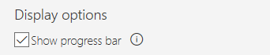
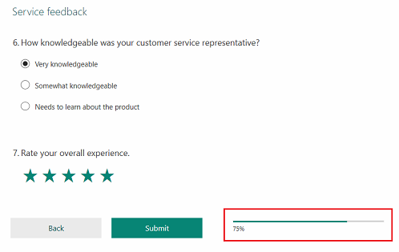

# Work with survey settings

After you've created a survey, you can select settings to control responses to your survey. You can choose whether anyone can respond to the survey, or only people in your organization. The former option doesn't require a respondent to sign in, whereas the latter option does require a respondent to sign in. You can also define various response and notification options.

## Define who can respond to a survey

Consider a scenario where you've created a survey to collect customer feedback when a support case is resolved. In this scenario, you'll require feedback from the people outside your organization. To accomplish this, you select the option **Anyone with the link can respond** in the survey settings. More information: [Anyone with the link can respond](#anyone-with-the-link-can-respond)

Let's consider another scenario where you've created a survey to collect feedback about an internal organization event and you want only the people in your organization to respond to the survey. To accomplish this, you select the option **Only people in my organization can respond** in the survey settings. More information: [Only people in my organization can respond](#only-people-in-my-organization-can-respond)

Let's now explore the options you can select to define who can respond to a survey, and the options for whether to record the respondent's name or limit the respondent to submit only one response.

### Anyone with the link can respond

1. Open the survey for which you want to change survey settings.

2. Select the ellipsis button **(...)** from the toolbar at the top of the page, and then select **Settings**.

    > [!div class=mx-imgBorder]
    > 

3. Select **Anyone with the link can respond**. When you select this option, respondents aren't required to sign in with their credentials.

4. Optionally, you can select one or both of the following options:

    - **Record name**: The respondent's name is recorded. This option works only if a [personalized survey link](#work-with-personalized-links) is generated.

    - **One response per person**: A respondent can submit only one response. This option is enabled only when **Record name** is selected and works only if a [personalized survey link](#work-with-personalized-links) is generated.

    > [!div class=mx-imgBorder]
    > 

### Only people in my organization can respond

1. Open the survey for which you want to change survey settings.

2. Select the ellipsis button **(…)** from the toolbar at the top of the page, and then select **Settings**.

    > [!div class=mx-imgBorder]
    > 

3. Select **Only people in my organization can respond**. When you select this option, respondents are required to sign in with their credentials.

4. Optionally, you can select one or both of the following options:

    - **Record name**: The respondent's name is recorded.

    - **One response per person**: A respondent can submit only one response.

    > [!div class=mx-imgBorder]
    > 

## Survey response options

When you've defined who can respond to your survey, you can select or clear the following options:

- **Accept responses**: Specify whether the survey is open and accepting responses. By default, this option is selected. If you want to stop your survey, clear the option and specify a message for the recipients.
- **Shuffle questions**: Specify whether the questions in the survey should be shuffled.
- **Show question numbers**: Specify whether the question numbers should be displayed in the survey. By default, this option is selected.
- **Customize thank you message**: Specify a customized thank-you message for your responders. You can also format the thank-you message to change its font style, font color, font name, and font size. You can also add a link to the message by selecting the **Link** button on the formatting toolbar, and then adding the link through the link editor.
- **Customize footer text**: Specify customized footer text to be displayed for your survey. You can also format the footer text to change its font style, font color, font name, and font size. You can also add a link to the message by selecting the **Link** button on the formatting toolbar, and then adding the link through the link editor.
- **Add respondents as**: Specify whether the respondent should be added as a contact in Common Data Service. By default, this option is selected. It works only with surveys sent through email.
- **Start date**: Specify a date when the survey will be open for respondents.

### Stop survey

You can specify a date, number of responses, or a time period after which the survey will be stopped and your respondents won't be able to complete the survey. If any one of the following conditions is true, the survey will be stopped:

- **End date**: Specify the date when the survey will be stopped.
- **Maximum responses**: Specify the maximum number of responses to be received, after which the responses will no longer be counted and the survey will be stopped.
- **Number of days**: Specify the number of days your survey will be open after you send the survey invitation. The maximum value that can be entered is 1,095. Respondents can use the personalized link to complete the survey from the date they receive the invitation until the specified number of days have passed.

### Notification

- **Send email receipt to respondents**: Specify whether respondents should receive an email confirmation of their responses. This option is enabled only when **Record name** is selected under **Only people in my organization can respond**. After your respondent has filled out your survey, the option **Send me an email receipt of my responses** is displayed. After submitting responses, respondents will then receive a confirmation email, which includes a thank-you message and link to view their responses.

- **Get email notification of each response**: Specify whether you need an email notification whenever a response is submitted.

> [!div class=mx-imgBorder]
> 

You can modify the authentication settings at any time, even after you've distributed the survey by email or other channels.

## Add a progress bar

A progress bar shows your respondents the percentage of pages that they've navigated to or viewed so far. It gives them an idea of how far they've come and how far they have to go. The progress bar takes into account all pages in the survey. If pages have been skipped due to a branching rule, the progress bar shows the adjusted completion percentage.<!--note from editor: I think this is a bit ambiguous. If "all pages in the survey" are taken into account, that would imply even the skipped pages. Would it be accurate to say "The progress bar takes into account only the pages that a respondent sees. If pages have been skipped due to a branching rule, the progress bar shows the adjusted completion percentage."?--> The progress bar is displayed only if there are two or more pages in the survey.

You can control the display of the progress bar by selecting or clearing the **Show progress bar** check box in survey settings. For surveys created after the February 2020 release, this check box is selected by default. For surveys created before the February 2020 release, you must select the **Show progress bar** check box.

> [!div class=mx-imgBorder]
> 

The progress bar is displayed to the right side of the buttons on the survey.

> [!div class=mx-imgBorder]
> 

## Work with personalized links

Personalized survey links or trackable links are generated when a survey is sent by using the built-in email composer and Power Automate. A survey link is unique to its recipient, and helps to record the respondent's name and/or whether the respondent can submit only one response.

When you send a survey by generating a link or a QR code, the survey links aren't personalized. In these cases, you won't be able to record the respondent's name and whether the respondent has submitted only one response, if you've selected **Anyone with the link can respond**.

### See also

[Send a survey by using email](send-survey-email.md) 
[Send a survey by using Power Automate](send-survey-flow.md) 
[Embed a survey in a webpage](embed-web-page.md) 
[Send a survey link to others](send-survey-link.md) 
[Send a survey QR code](send-survey-qrcode.md) 
[Embed a survey in Power Apps](embed-survey-powerapps.md)
