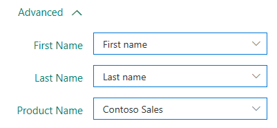

# Personalize a survey

[!include[cc-beta-prerelease-disclaimer](includes/cc-beta-prerelease-disclaimer.md)]

With placeholders, automatically insert customer information into your survey by using custom data. For example, you can use custom data to automatically insert a customer's first name into a question to personalize it.

By default, the following custom data are available:

- First name
- Last name

To select or add a new custom data:

1.	Open the survey in which you want to use custom data.

2.	On the **Create Questions** tab, select the ellipsis button (…) from the toolbar at the top of the page, and then select **Custom data**.

    

3.	From the list of available custom data, select the custom data that you want to use in your survey.

4.	To add new custom data, select **Add custom data**.

5.	Enter a name for the custom data.

6.	Select **Add**.

> [!NOTE]
> - You can also personalize survey invitations. More information: [Personalize an email](distribute-survey-email.md#personalize-an-email).
> - Don't use custom data if you plan to distribute a survey anonymously. Placeholders will not be replaced with actual data in an anonymous survey.
> - Custom data placeholders are replaced with the values specified in appropriate fields in a survey email.

## Add custom data placeholders to a question

<!--note from editor:  To make a little bit clearer, suggest changing "After selecting or adding the required custom data, you must add them in the questions."
to
"After selecting or adding the required custom data, you need to associate that data with placeholders in the question."  -->

After selecting or adding the required custom data, you must add them in the questions. To add custom data placeholders to a question:

1.	Open the survey in which you want to add custom data placeholders.

2.	On the **Create Questions** tab, select the question text to which you want to add custom data. The formatting toolbar appears.

3.	Place the cursor at the location where you want to add the custom data placeholder.

4.	From the **Pipes** list in the formatting toolbar, select the custom data that you want to add. 

    

For example, you have created custom data named **Product Name**, and you want to display the customer's first name and the product name in a question. Select **First Name** and **Product Name** custom data from the **Pipes** list. The {{First Name}} and {{Product Name}} placeholders are inserted at the cursor location.

Let's say the question is: {{First Name}}, overall, how would you rate your experience with customer service for {{Product Name}}?

That question will look like this when a customer named Bert Hair takes the survey for a product named Contoso Sales:

Bert, overall, how would you rate your experience with customer service for Contoso Sales?

## Specify values for custom data placeholders

After adding and using custom data placeholders in a question, specify values for them. If you do not specify values for them, the placeholders are not replaced with the values and are displayed as is. You can specify the values for custom data placeholders: 

- When sending an email.
- When configuring a flow.

### Specify values in an email

To specify values for custom data placeholders in an email, enter or select the values in the **Advanced** section when sending email invitations.

### Specify values in a flow

To specify values for custom data placeholders in a flow:

1.	While configuring a flow, select **Edit in advanced mode**.

    

2.	Go to the step that sends the survey, and expand it.

3.	Select **Show advanced options**.

    

4.	Specify the values for custom data placeholders.

    

5.	Save the changes. 

