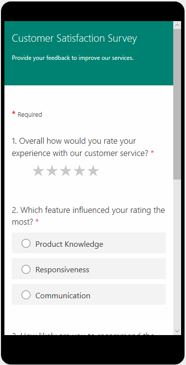

# Preview and test a survey

> [!NOTE]
> Microsoft Forms Pro has evolved into Dynamics 365 Customer Voice, providing you with additional survey capabilities and business benefits. The change is being introduced in phases and will be available in all geographical regions in the next few weeks, except for US Government Community Cloud customers. Dynamics 365 Customer Voice will be available on US Government Community Cloud by October 2020. For more information, see the [Dynamics 365 Customer Voice](https://go.microsoft.com/fwlink/p/?linkid=2128357) documentation.

After you've created and edited a survey, preview and test it before distributing it to respondents:

1.  Open the survey you want to preview.

2.  Select **Preview** from the toolbar at the top of the page to see how your survey will look on a computer.

3.  To test your survey, enter responses for the questions in preview mode, and then select **Submit**.

    > [!div class=mx-imgBorder]
    > 

4.  To see how your survey will look on a mobile device, select **Mobile**.

    

5.  After previewing and testing your survey, select **Back**.

### See also

[Create a new survey](create-new-survey.md) 
[Apply a theme to a survey](apply-theme.md) 
[Create a branching rule](create-branching-rule.md) 
[Personalize a survey](personalize-survey.md) 
[Format text in a survey](survey-text-format.md) 
[Create a classic form](create-classic-form.md) 
[Create a multilingual survey](create-multilingual-survey.md) 
[Create a multiple-page survey](create-multipage-survey.md)
