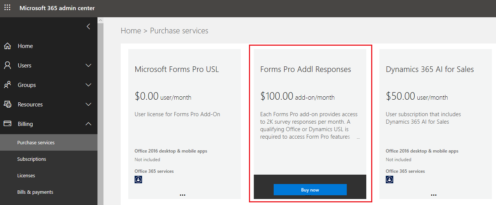
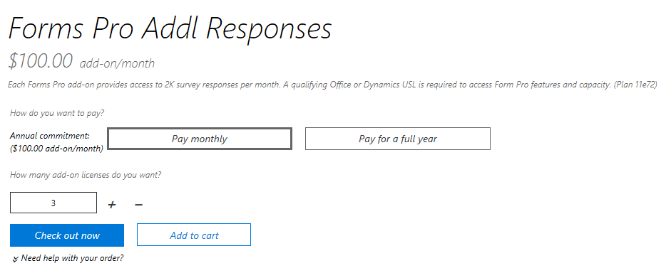
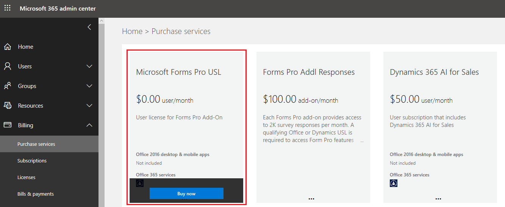
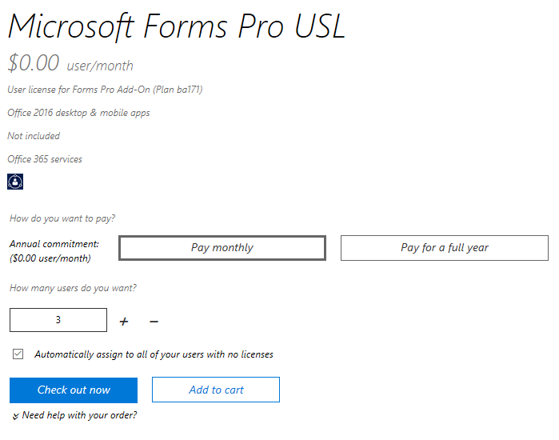

# Purchase Microsoft Forms Pro

Microsoft Forms Pro is included with select Microsoft Dynamics 365 subscriptions and is available as an upgrade for Microsoft 365 subscriptions.

The Forms Pro license is based on the number of survey responses received per month. The capacity is measured at the tenant level.

- For a Dynamics 365 enterprise licensed tenant, 2,000 responses are free and the customer can choose to purchase additional responses in bundles of $100 for 2,000 responses per month.
- For a Microsoft 365 licensed customer, there are no free responses included. The customer has to purchase responses in bundles of $100 for 2,000 responses per month.
- If a tenant has a Microsoft 365 license, turning off the license for Microsoft Forms will also turn off Microsoft Forms Pro.

## Enable Forms Pro for users with Dynamics 365 enterprise licenses

Forms Pro is included with Dynamics 365 Sales Enterprise, Dynamics 365 Customer Service Enterprise, Dynamics 365 Field Service, Dynamics 365 Marketing, Dynamics 365 Talent, Dynamics 365 Project Service Automation, Dynamics 365 Operations, and Dynamics 365 Relationship Sales. Other Dynamics 365 customers can purchase Forms Pro separately.

A tenant with a Dynamics 365 enterprise license has 2,000 responses per month included at the tenant level (irrespective of how many seats the tenant has).

1. Sign in to Forms.

2. Select your username from the upper-right corner of the page.

3. Select **Switch to Forms Pro**.

If the free responses are exhausted, you can purchase additional responses as mentioned in the following section.

### Purchase additional responses

You can purchase additional responses from the Microsoft 365 admin center.
 
1. Go to the [Microsoft 365 admin center](https://admin.microsoft.com/). 

2. In the left pane, select **Billing** > **Purchase services**.

3. Find **Forms Pro Addl Responses**, and then select **Buy now**.

    > [!div class=mx-imgBorder]
    > 

4. Select the number of add-on licenses to purchase, and complete the purchase process. The purchased capacities are added on top of the 2,000 responses per month.

    > [!div class=mx-imgBorder]
    > 
 
### Disable Microsoft Forms Pro for a user

Microsoft Forms Pro is available to all users who have a Dynamics 365 enterprise license. If you want to disable Microsoft Forms Pro for a user:

1. Go to the [Microsoft 365 admin center](https://admin.microsoft.com/).

2. In the left pane, select **Users** > **Active users**.

3. Open the user record for which you need to disable Microsoft Forms Pro.

4. In the **Product licenses** row, select **Edit**.

5. On the **Product licenses** page, turn the **Microsoft Forms Pro** toggle to **Off** for the following products:
    - Microsoft Forms Pro for Sales Enterprise
    - Microsoft Forms Pro for Customer Service Enterprise
    - Microsoft Forms Pro for Field Service
    - Microsoft Forms Pro for Marketing USL
    - Microsoft Forms Pro for Talent
    - Microsoft Forms Pro for Project Service Automation
    - Microsoft Forms Pro for Customer Engagement Plan
    - Microsoft Forms Pro for Operations
    - Microsoft Forms Pro for Relationship Sales

### Enable Microsoft Forms Pro for a user without a Dynamics 365 enterprise license

If you need to provide access to Microsoft Forms Pro for users who don't have a Dynamics 365 enterprise license:

1. Go to the [Microsoft 365 admin center](https://admin.microsoft.com/).

2. In the left pane, select **Billing** > **Purchase services**.

3. Find **Microsoft Forms Pro USL**, and then select **Buy now**. Microsoft Forms Pro USL is a free user license.

    > [!div class=mx-imgBorder]
    > 

4. Select the number of user licenses to purchase, and complete the purchase process.

    > [!div class=mx-imgBorder]
    > 

5. Assign the **Microsoft Forms Pro USL** license to users in your organization:

   1. In the left pane, select **Users** > **Active users**.

   2. Open the user record to which you need to add a Microsoft Forms Pro license.

   3. In the **Product licenses** row, select **Edit**.

   4. On the **Product licenses** page, turn the **Microsoft Forms Pro USL** toggle to **On**.

## Purchase Microsoft Forms Pro for users in an Office 365 tenant
<!--note from editor: Did the name of Office 365 tenant change? Since they changed Office 365 to Microsoft 365, I'm wondering if they changed Office 365 tenant to Microsoft 365 tenant, too. Can you please find out and if they did, fix that reference as well? And let me know. Doing a cursory search online, it looks like they have NOT made that change. -->
If your tenant doesn't have Dynamics 365 enterprise licenses that include Microsoft Forms Pro, follow these steps to purchase Microsoft Forms Pro:

1. Go to the [Microsoft 365 admin center](https://admin.microsoft.com/).

2. In the left pane, select **Billing** > **Purchase services**.

3. Find **Forms Pro Addl Responses**, and then select **Buy now**.

    > [!div class=mx-imgBorder]
    > 

4. Select the number of add-on licenses to purchase, and complete the purchase process. 

    > [!div class=mx-imgBorder]
    > 

5. In the left pane, select **Billing** > **Purchase services**.

6. Find **Microsoft Forms Pro USL**, and then select **Buy now**. Microsoft Forms Pro USL is a free user license.

    > [!div class=mx-imgBorder]
    > 

7. Select the number of users to purchase, and complete the purchase process.

    > [!div class=mx-imgBorder]
    > 

8. Assign the **Microsoft Forms Pro USL** license to users in your organization:

   1. In the left pane, select **Users** > **Active users**.

   2. Open the user record to which you need to add a Microsoft Forms Pro license.

   3. In the **Product licenses** row, select **Edit**.

   4. On the **Product licenses** page, turn the **Microsoft Forms Pro USL** toggle to **On**.

### Disable Microsoft Forms Pro for a user

1. Go to the [Microsoft 365 admin center](https://admin.microsoft.com/).

2. In the left pane, select **Users** > **Active users**.

3. Open the user record for which you need to disable Microsoft Forms Pro.

4. In the **Product licenses** row, select **Edit**.

5. On the **Product licenses** page, turn the **Microsoft Forms Pro USL** toggle to **Off**.

## Response capacity consumption

One additional license, Forms Pro Addl Responses, costs $100 and allows you to receive 2,000 responses per month at a tenant level. This means that everyone in the tenant can use a total of 2,000 responses. You can purchase the licenses in bundles of $100 as required. So if you purchase one Forms Pro Addl Responses license (for a bill amount of $1,200), you'll get 24,000 responses (12 &times; 2,000) annually. If you purchase two licenses of $100 each per month for a year (for a bill amount of $2,400), you'll get 48,000 responses (12 &times; 4,000) annually.

You can pay for the licenses by using either of the payment modes: monthly or yearly. Regardless of the payment mode, the response capacity is calculated annually.

> [!NOTE]
> If you select the monthly payment method, you'll be able to consume the responses in accordance with the annual capacity as long as your payment mode is active.

You can send as many survey invitations as you want; invitations aren't counted toward response capacity consumption. Only the responses received, for both anonymous and non-anonymous surveys, are counted toward response capacity consumption.

If the consumed response capacity reaches or exceeds the annual response capacity in any given month, Forms Pro will stop receiving new responses and won't allow new surveys to be created. In this case, you must contact your administrator to purchase additional responses. After the administrator purchases additional responses, you'll start receiving responses and be able to create new surveys. Note that any survey responses received during this period won't be processed; only responses received after additional responses are purchased will be processed.

If you have any unused responses remaining in a year, those responses won't be carried forward to the next year. For example, if you bought one additional license and didn't receive any response in the first year, the response capacity for the second year will be 24,000 and not 48,000 (24,000 &times; 2).

Let's understand this with the following example:

You purchase an additional license of $100 per month for a year (for a bill amount of $1,200). You'll get 24,000 responses (12 &times; 2,000) annually. If you exhaust all 24,000 responses in the tenth month from the date of purchase, Forms Pro will stop receiving new responses and won't allow new surveys to be created. As soon as your administrator purchases additional responses, you'll start receiving responses and be able to create new surveys.

In this example, suppose you have 5,000 responses remaining at the end of the year. Those responses won't be carried forward to the next year.

## Response capacity consumption

One additional license, Forms Pro Addl Responses, costs $100 and allows you to receive 2,000 responses per month at a tenant level. This means that everyone in the tenant can use a total of 2,000 responses. You can purchase the licenses in bundles of $100 as required. So if you purchase one Forms Pro Addl Responses license (for a bill amount of $1,200), you'll get 24,000 responses (12 &times; 2,000) annually. If you purchase two licenses of $100 each per month for a year (for a bill amount of $2,400), you'll get 48,000 responses (12 &times; 4,000) annually.

You can pay for the licenses by using either of the payment modes: monthly or yearly. Regardless of the payment mode, the response capacity is calculated annually.

> [!NOTE]
> If you select the monthly payment method, you'll be able to consume the responses in accordance with the annual capacity as long as your payment mode is active.

You can send as many survey invitations as you want; invitations aren't counted toward response capacity consumption. Only the responses received, for both anonymous and non-anonymous surveys, are counted toward response capacity consumption.

If the consumed response capacity reaches or exceeds the annual response capacity in any given month, Forms Pro will stop receiving new responses and won't allow new surveys to be created. In this case, you must contact your administrator to purchase additional responses. After the administrator purchases additional responses, you'll start receiving responses and be able to create new surveys. Note that any survey responses received during this period won't be processed; only responses received after additional responses are purchased will be processed.

If you have any unused responses remaining in a year, those responses won't be carried forward to the next year. For example, if you bought one additional license and didn't receive any response in the first year, the response capacity for the second year will be 24,000 and not 48,000 (24,000 &times; 2).

Let's understand this with the following example:

You purchase an additional license of $100 per month for a year (for a bill amount of $1,200). You'll get 24,000 responses (12 &times; 2,000) annually. If you exhaust all 24,000 responses in the tenth month from the date of purchase, Forms Pro will stop receiving new responses and won't allow new surveys to be created. As soon as your administrator purchases additional responses, you'll start receiving responses and be able to create new surveys.

In this example, suppose you have 5,000 responses remaining at the end of the year. Those responses won't be carried forward to the next year.

### See also

[Plan a survey](plan-survey.md) 
[Create surveys](create-survey.md) 
[Send a survey to get responses](send-survey.md) 
[Collaborate on a survey](collaborate-survey.md) 
[Analyze responses and invitations](analyze-responses-invites.md) 
[Work with environments](choose-environment.md)
