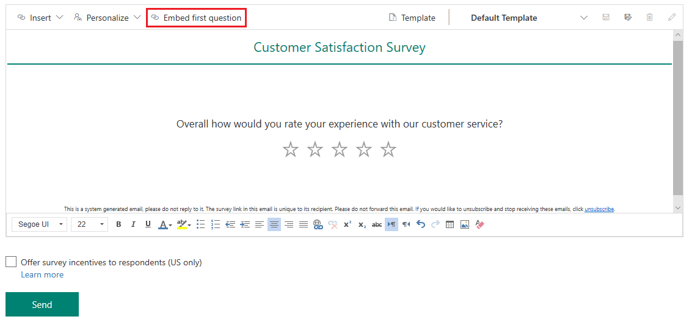
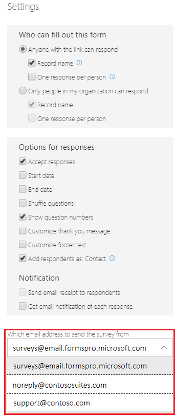
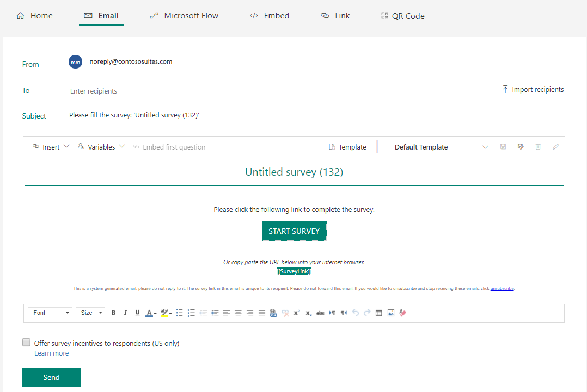

# Send a survey by using email

After creating a survey, you can send it through email: 

1.  Open the survey you want to send, and select **Send** from the toolbar at the top of the page. 

2. Select **Email**. A default subject line and email message appear, along with a link to your survey in the message body. You can modify and format the text to meet your requirements.

3.  In the **To** field, enter the recipient's name or email address. You can populate the **To** field by any of the following ways:
    - Entering an email address manually.
    - Entering a name, email address, or a distribution list from Azure Active Directory.
    - Entering a contact or contact list/view from Common Data Services for Apps. The contacts are populated from the selected environment. For more information on working with environments, see [Work with environments](choose-environment.md).
    - Uploading a .csv file by selecting **Import recipients**. The CSV file supports importing a maximum of 10000 recipients.

4.  To insert the survey link into your email message, see [Insert survey link](#insert-survey-link).  

5.  To add an unsubscribe link to your email message, see [Unsubscribe from a survey](#unsubscribe-from-a-survey).  

6.  To personalize the email by using survey variables, see [Personalize an email](#personalize-an-email).

7. To embed the first question of the survey into your email message, see [Embed survey in an email](#embed-survey-in-an-email).

8.  To select an email template, select a template from the **Template** drop-down list. By default, **Default Template** is selected. More information: [Use email templates](#use-email-templates)  

9.  When you're ready to send your survey, select **Send**.

> [!NOTE]
> You can send a survey invitation to a maximum of 10000 recipients.

## Insert survey link

The survey link is added to your email message by default. To insert the survey link in a different location in your email message, place the cursor at the required location, and select **Insert** > **Survey link**. You can also select text, and then select **Insert** > **Survey link** to display that text as the survey link.

## Unsubscribe from a survey

You can configure your email message to include a link that allows a respondent to unsubscribe from the survey. To insert the unsubscribe link in the email message, place the cursor at the required location, and then select **Insert** > **Unsubscribe link**. You can also select text, and then select **Insert** > **Unsubscribe link** to display that text as the unsubscribe link. By default, the unsubscribe link is added to all email message templates.

## Personalize an email

Personalize your survey email by using survey variables. For example, place the cursor where you want a first name to appear. Select **Variables**, and then select **First name** from the drop-down list. The first name of the respondent will be automatically inserted. All the survey variables created in a survey are displayed in the **Variables** list.

To create a new variable, select **New variable** from the **Variables** list. For information on creating and providing values to the variables, see [Personalize a survey](personalize-survey.md)

If the default values are not defined for survey variables, a warning message is displayed at the top of the page.

## Embed survey in an email

If you have added a Rating or Net Promoter Score question as the first question in your survey, you can embed it in your email message. To embed the question, select **Embed first question**. When you embed a question, the text in the email message is replaced by the question. When a responder selects an option in the email, the complete survey is opened in the web browser and the responder can continue with completing the survey.

> [!div class=mx-imgBorder]
> 

> [!NOTE]
> You cannot embed the question in an email if you have added any branching rules or shuffled the questions in a survey.

## Use email templates

An email template is a preformatted email message that allows you to quickly create and send email messages. You can modify the text, and then save your changes to the current email template or save the changes to a new email template. Unless you make another selection, **Default Template** is selected for use in an email message. 

You can perform these actions on an email template:

- **Save**: Save your changes to the current email template.

- **Save as**: Save your changes to a new email template.

- **Delete**: Delete the current email template.

- **Rename**: Rename the current email template.

> [!NOTE]
> - You can save a maximum of 10 email templates.
> - If you have used survey variables in an email template, which are not part of the survey, an error message is displayed at the top of the page and you are not allowed to send the survey through email or Flow. The survey variables are highlighted in red. You must remove the highlighted survey variables from the email message to send the survey.

## Customize the From email address

You can customize the email address from which the survey invitation is sent yo your respondents by contacting Microsoft support and then creating the required CNAME records manually. Customization helps you to select an email address that matches with your company's brand.

1.	Contact Microsoft support and ask for the Forms Pro provisioned location. When contacting Microsoft support, mention the **Issue title** as **Customize the From email address to send survey invitations**. For information on contacting Microsoft support, see [Get Help + Support](https://docs.microsoft.com/power-platform/admin/get-help-support). While creating a new support request, select the **Product** as **Dynamics 365 Customer Engagement**, **Problem type** as **Forms Pro**, and select your Common Data Service environment. 

2.	After you get the location, create two CNAME records on your domain. The CNAME records will be used for DKIM authentication.

    Use the following format for the CNAME records.

    > [!IMPORTANT]
    > If your customized domain is `contoso.com`, your domainGuid will be `contosocom`. You must remove any periods, underscores, and dashes.
    > The selectors will be as per the Forms Pro provisioned location:
    > - For North America (NAM), selector will be "fpnamkey1" or " fpnamkey2".
    > - For Europe (EUR), selector will be "fpeurkey1" or " fpeurkey2".
  
    ``` text
    Host name:                    selector1._domainkey
    Points to address or value:   selector1<domainGUID>.marketing.dynamics.com
    TTL:                          3600 
    Host name:                    selector2._domainkey
    Points to address or value:	  selector2<domainGUID>.marketing.dynamics.com
    TTL:                          3600
    ```

    For example, if your Forms Pro provisioned location is North America (NAM), and you have two custom domains cohovineyard.com  and cohowinery.com, you would need to set up two CNAME records for each additional domain (a total of four CNAME records).

    ``` text
    Host name:                    fpnamkey1._domainkey
    Points to address or value:   fpnamkey1cohovineyardcom.marketing.dynamics.com
    TTL:                          3600 
    Host name:                    fpnamkey2._domainkey
    Points to address or value:   fpnamkey1cohovineyardcom.marketing.dynamics.com
    TTL:                          3600
    Host name:                    fpnamkey1._domainkey
    Points to address or value:   fpnamkey1cohowinerycom.marketing.dynamics.com
    TTL:                          3600 
    Host name:                    fpnamkey2._domainkey
    Points to address or value:   fpnamkey1cohowinerycom.marketing.dynamics.com
    TTL:                          3600
    ```

3.	Contact Microsoft support to verify the records and create the DKIM keys for signing the emails. You must provide a list of email addresses you want to create, such as support@contoso.com and noreply@contoso.com. You must also provide a list of users who will be sending the survey invitations using the custom email.

4.	After the Microsoft support team confirms that the record verification is complete, sign in to Forms Pro and open the **Settings** pane. Select the custom email address that should be used for sending email.  

    > [!div class=mx-imgBorder]
    > 

    When the custom email is selected, you can use it while sending the survey invitation.

    > [!div class=mx-imgBorder]
    > 

    > [!NOTE]
    > In Power Automate, custom email address is picked from the survey settings.

### Frequently asked questions

#### Should the email account be a functioning account, or can it be a dummy account?

The email account need not be a functioning email account to send the emails. But, if replies are expected to be received on that email account, a mailbox must be configured for that email account. In most cases, the email address from which a customer sends survey emails are unmonitored email accounts and need not receive emails.
 
#### How long does it take for the setup to complete?

It may take up to 24 to 72 hours for the setup to complete. Once the Microsoft support confirms the domain is active, you can start sending survey invitations using the custom email.

## See also

[Work with survey settings](invite-settings.md)<br>
[Send a survey by using Microsoft Flow](send-survey-microsoft-flow.md)<br>
[Embed survey in a webpage](embed-web-page.md)<br>
[Send a survey link to others](send-survey-link.md)<br>
[Send a survey QR code](send-survey-qrcode.md)<br>
[Embed a survey in PowerApps](embed-survey-powerapps.md)
