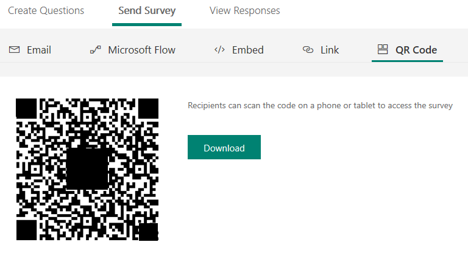

# Send a survey QR code 

[!include[cc-beta-prerelease-disclaimer](includes/cc-beta-prerelease-disclaimer.md)]

You can generate a QR code for your recipients to scan it on a phone or tablet to access the survey.

> [!NOTE]
> The survey link generated is a non-personalized link. You will not be able to record the respondent's name and whether the respondent has submitted only one response if you select **Anyone with the link can respond** in [survey settings](invite-settings.md).

1.  Open the survey you want to send, and go to **Send Survey** &gt; **QR code**.

2.  Select **Download**, and then share the QR code wherever your intended audience can scan it with a QR code scanner such as a mobile device.

      

