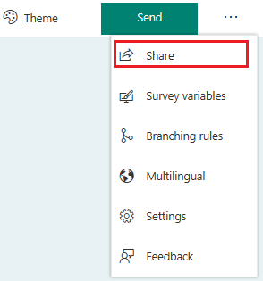
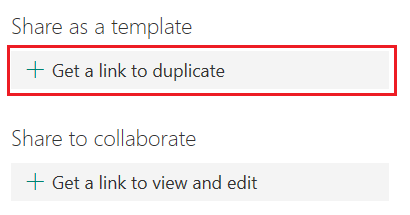
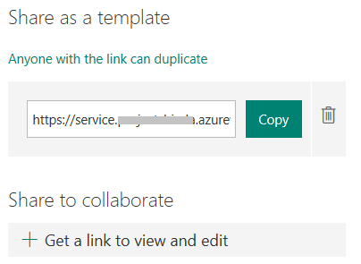

# Share a survey as a template

You can easily share a survey as a template so that other people in your organization can duplicate it and use it as their own. When you make a copy of a survey, the copy exists in your profile. When you share a survey as a template, you create a special link which allows others to duplicate the survey in their own profile where they can make changes to it. When you share a survey as a template, only the structure of the survey is duplicated. No existing response data is carried over to the new survey when someone else duplicates it.

1.  Open the survey you want to share as a template.

2.  In the **Create Questions** tab, select **Share** from the toolbar at the top.

   

3.  Select **Get a link to duplicate**.

   

4.  Select **Copy** next to the text box that displays a survey URL.

   

5.  Share this link with your intended audience.

6.  When another person navigates to that survey URL, they must select **Duplicate it** at the top or bottom of the survey to create a copy of the survey in their own profile which they can modify to their needs.

