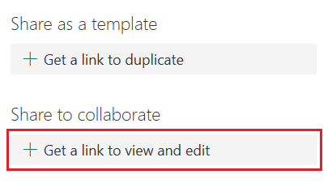
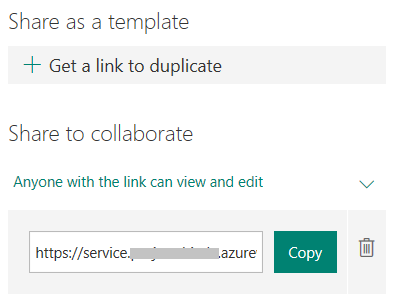

# Share a survey for collaborating

When you share a survey for collaborating, it remains in your profile, but other people can view and edit it through a special URL created for collaborators. At the top of the survey that you've shared, you'll see icons of the initials for each person making edits to the survey. When you share a survey, it is available in the **Shared with me** section on the home page.

Microsoft Forms Pro also displays contributor icons next to each section currently being edited.

1.  Open the survey you want to share for collaboration.

2.  Select the **ellipsis** button (…) from the toolbar at the top of the page, and then select **Share**.

    > [!div class=mx-imgBorder]
    > 

3.  Select **Get a link to view and edit**.

    > [!div class=mx-imgBorder]
    >   

4.  Select **Copy** next to the text box that displays a survey URL.

    > [!div class=mx-imgBorder]
    >   

5.  Share this link with your intended audience.

## See also

[Share a survey as a template](share-survey-template.md) 

