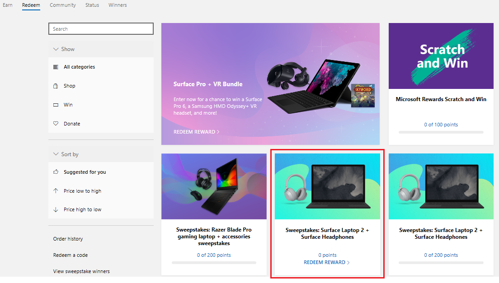

# Offer survey incentives to your respondents

As a survey owner, when you send surveys to your recipients, you expect to get a high response rate. The more survey responses received, the better insights you could get from the survey. However, survey response rate is typically low—on an average it might be as low as a single digit percentage. One of the best ways for increasing the response rate is by providing incentives for the recipient to respond to the survey.

[Microsoft Forms Pro](https://formspro.microsoft.com) integrates with [Microsoft Rewards](https://www.microsoft.com/rewards) to provide survey incentives. When you enable the survey incentives option, the respondent who complete the survey will be given a promo code to enter monthly sweepstakes to win a Microsoft Surface laptop plus a pair of Surface Headphones.

> [!NOTE]
> - For this release, survey incentives are available only when a survey invitation is sent through email. More information for sending a survey invitation through email: [Send a survey by using email](send-survey-email.md)
> - The survey incentives capability is currently available only in the US region. Only the survey responders based in the US region will be able to view, access, and redeem the promo codes. 
> - Promo codes allow a responder to enter Microsoft Surface book sweepstakes and are valid only until the end of the month. For detailed terms and conditions, see the [Microsoft Services Agreement](https://go.microsoft.com/fwlink/p/?linkid=530144).
> - A Microsoft account is required to redeem the promo code. Per day, only one promo code can be redeemed using a Microsoft account, up to a maximum of 10 sweepstakes entries in a month.

## Disable survey incentives in a tenant

As a tenant administrator, you can enable or disable survey incentives in a tenant to allow or restrict survey designers to offer survey incentives to their recipients. By default, survey incentives are enabled in a tenant.

To disable survey incentives:

1. Go to the [Microsoft 365 admin center](https://admin.microsoft.com/).

2. In the left pane, select **Settings** > **Services & add-ins**.

3. Select **Microsoft Forms**.

4. Under **Survey incentive**, turn the **Allow incentives to be added for surveys created using Forms Pro** toggle to **Off**.

When the survey incentives are turned off, the option of offer survey incentives in a survey invitation is also disabled.

## Enable survey incentives in survey invitation email

When survey incentives are enabled by your administrator in your tenant, you can offer incentives to your respondents. Survey incentives can be enabled only while sending a survey through email. This gives you the control to enable incentives only for the required respondents.

1. Open the survey in which you want to enable survey incentives, and go to **Send survey** &gt; **Email**.

2. Below the email editor, select **Offer survey incentives to respondents (US only)**.

3. Optionally, include a text in the email invitation to let the survey respondent know about the survey incentives or insert the sample text by selecting **Insert** > **Survey incentives information**. 

After a respondent completes a survey, a promo code is displayed. The respondent can then go to the Microsoft Rewards dashboard to redeem the code and enter sweepstakes.

> [!NOTE]
> A disclaimer and a link to the terms and conditions is automatically added at the end of the email message when you send a survey invitation email.

## Experience of a survey respondent

If survey incentives are enabled and a respondent, meeting the eligibility criteria for incentives, completes a survey, a promo code is displayed. The promo code must be redeemed through the Microsoft Rewards dashboard to enter sweepstakes.

To redeem a code:

1. Select **Redeem code** on the thank you page after completing the survey.

2. Sign in to your Microsoft Rewards dashboard.

3. On the **Redeem your code** page, enter the promo code, and select **Next**.

4. On the thank you page, select **Redeem**.

5. On the **Promo code validated!** page, select the link to complete the sweepstakes entry.

6. On the **Free Sweepstakes entry** page, verify the displayed information, and select **Enter sweepstakes**.

7. On the **Confirm your reward** page, select **Confirm reward**.

You must receive a confirmation email from Microsoft Rewards about your sweepstakes entry. If you do not receive any email confirmation:

1. Sign in to [https://account.microsoft.com/rewards/redeem/](https://account.microsoft.com/rewards/redeem/).

2. Find the **Sweepstakes: Surface Laptop 2 + Surface Headphones** tile. If the **Redeem reward** link is available on the tile, the redeem process is not completed successfully.

    > [!div class=mx-imgBorder]
    > 

3. Select **Redeem reward** and finish the sweepstakes entry. A confirmation email from Microsoft Rewards will be sent.

