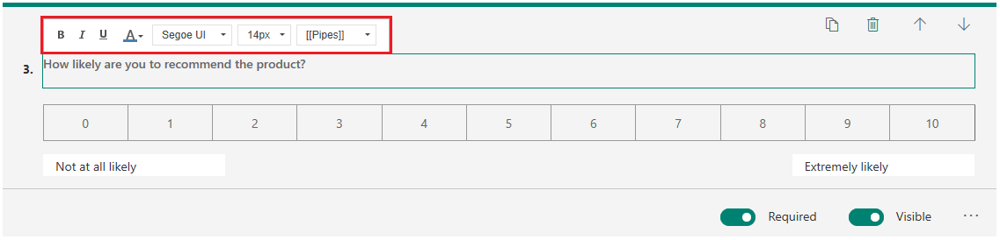
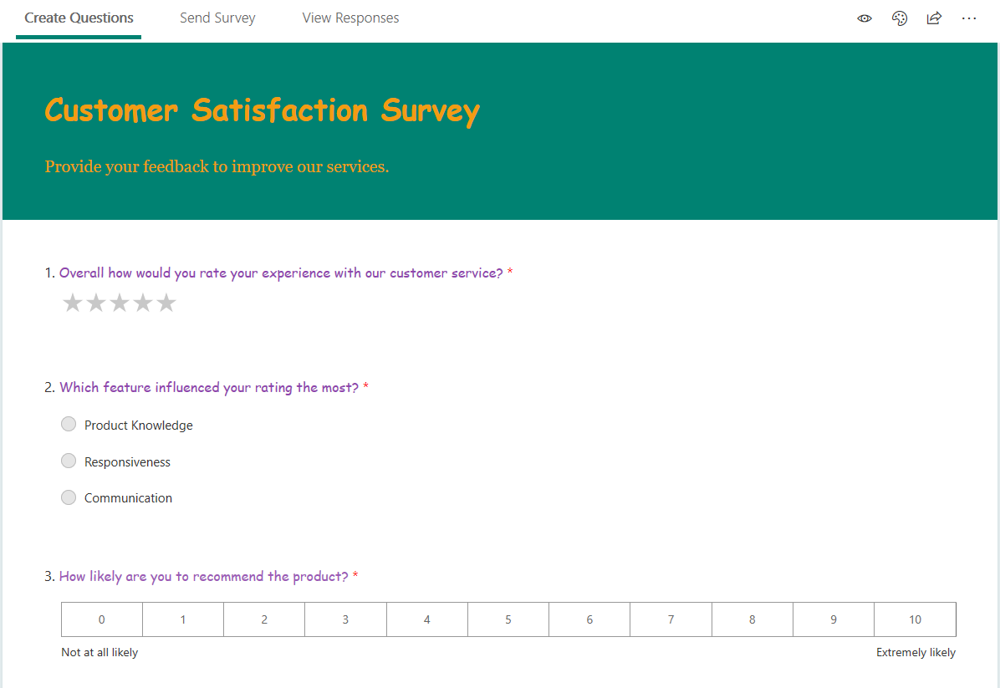

# Format text in a survey

Format text in a survey to change font style, font color, font name, and font size. You can apply formatting to the following elements:

- Survey heading
- Survey description
- Question text
- Question subtitle
- Question options
- Section heading
- Section description
- Thank you message
- Footer text
- Left and right labels for Net Promoter Score and Rating questions
- Statements for Likert question

> [!NOTE]
> The text formatting capability isn't supported for options of Ranking and Likert questions.

To format the text:

1.	Open the survey in which you want to format text.

2.	On the **Questions** tab, select the text that you want to format. The formatting toolbar appears.

3. Choose formatting for your survey text.

    > [!div class=mx-imgBorder]
    > 

For example, in this survey, formatting has been applied to the elements that you selected earlier:

> [!div class=mx-imgBorder]
> 

> [!NOTE]
> The thank-you message and footer text are available in the **Settings** pane. You can format them by using the formatting toolbar. More information: [Survey response options](invite-settings.md#survey-response-options)

### See also

[Create a new survey](create-new-survey.md) 
[Apply a theme to a survey](apply-theme.md) 
[Preview and test a survey](preview-test-survey.md) 
[Create a branching rule](create-branching-rule.md) 
[Personalize a survey](personalize-survey.md) 
[Create a classic form](create-classic-form.md) 
[Create a multilingual survey](create-multilingual-survey.md) 
[Create a multipage survey](create-multipage-survey.md)
