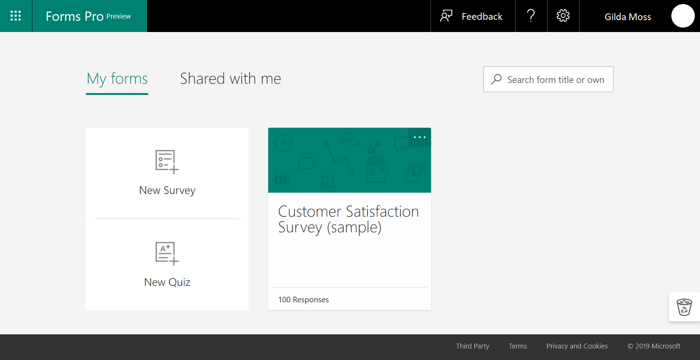

# Microsoft Forms Pro preview

Welcome to Microsoft Forms Pro preview! 

Access to the preview is controlled by your administrator at this time. Please reach out to them to grant you the access or visit [Forms Pro website](http://aka.ms/formspro) on March 12, 2019 to start the preview. If you already have the access, sign in using your credentials.

> [!NOTE]
> A Microsoft account is required for the preview. If you don't have a Microsoft account, create to get access to the Forms Pro preview.

When you are successfully signed in to Forms Pro, you see the appropriate brand name on the top and a sample customer satisfaction survey.

  
