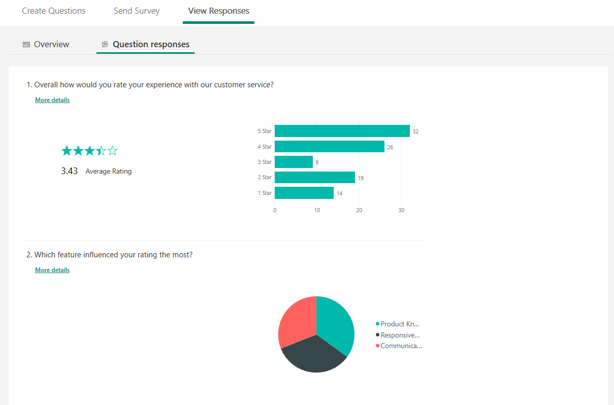
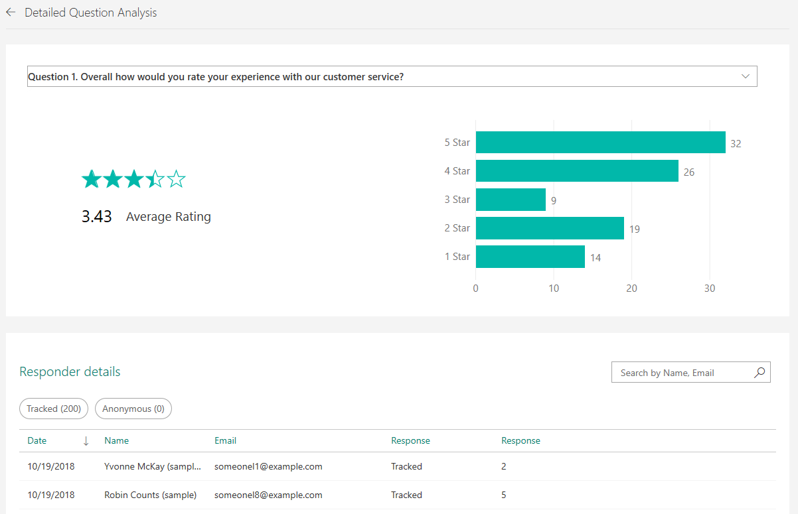
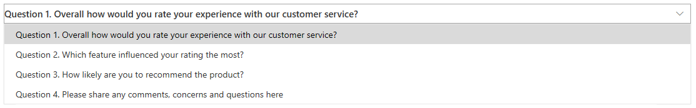

# View details for each question

[!include[cc-beta-prerelease-disclaimer](includes/cc-beta-prerelease-disclaimer.md)]

You can view details for each question in the survey by going to **View Responses** &gt; **Question responses**. A graphical representation of the responses is displayed. The visualizations on the **Question responses** page are all connected to each other. What this means is that if you select one or more values in one visualization, other visualizations that use that same value will change based on your selection.

To see the name of each respondent and his or her responses to each question, select **More details**. The **Detailed Question Analysis** page opens with the detailed information.

To navigate to a different question, select the required question from the question drop-down list.

## See also

[View summary information for your survey](view-summary-information.md) 
[Analyze survey invitations](analyze-survey-invitations.md) 
[Analyze survey responses](analyze-survey-responses.md) 
[Analyze survey insights](analyze-survey-insights.md)