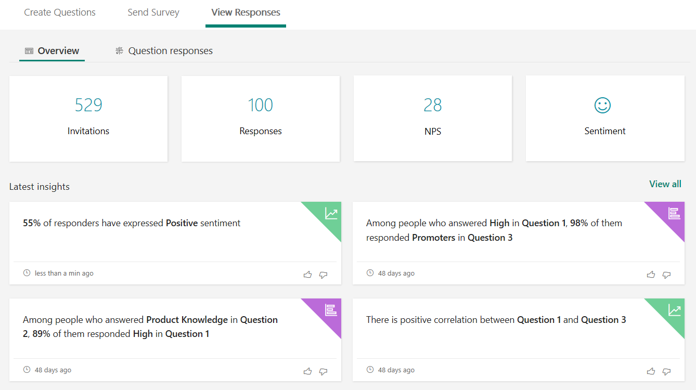

# View summary information for your survey

After you create your survey, adjust its settings, and share your survey with others, it’s time to view the results and insights. Open the survey that you want to review, and then select the **View Responses** tab.

On the **Overview** tab, you’ll see summary data about your survey, such as number of invitations sent, number of responses received, Net Promoter Score (NPS), respondent sentiment, and survey insights. You can select **Invitations** or **Responses** to get more details.

The following statistics are displayed:

- **Invitations**: Total number of survey invitations sent.

- **Responses**: Total number of survey responses received.

- **NPS**: Net Promotor Score of the survey.

- **Sentiment**: Average sentiment of the respondents: positive, neutral, or negative.

- **Latest insights**: Correlation and sentiment are displayed based on the survey responses.

  

